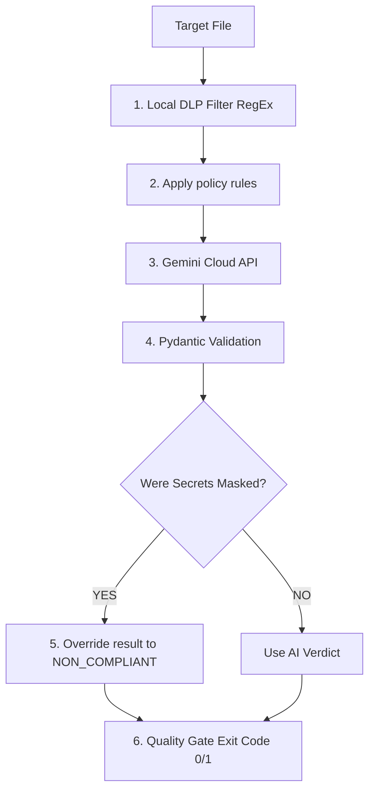

# AI Security Pipeline Guard

A Python CLI tool and GitHub Action that scans source code and Docker configurations for security issues.

It uses rule-based checks (regex/static patterns) as the primary detection layer, with optional LLM validation for edge cases.

Sensitive data is filtered locally before any external API calls.

#  How It Works (Pipeline Steps)

- **Policy loading (policy-as-code):** Rules are loaded from `rules/docker_rules.json` and define scan patterns for code and Docker configs.

- **Local secret detection (DLP pre-filter):** Code is scanned locally using regex rules to detect secrets (API keys, tokens, passwords). Matches are redacted before any external processing.

- **External analysis (Gemini API):** Sanitized input is sent to the LLM for additional validation. Retry with exponential backoff handles rate limits and transient failures.

- **Response validation:** Output is validated with a strict Pydantic schema.

- **Safety override:** If secrets were detected locally, the result is forced to `NON_COMPLIANT`.

- **CI/CD quality gate:** The tool exits with `sys.exit(1)` on violations to block CI pipelines.

# Quick Start

Prerequisites

Python 3.10+
Google Gemini API Key

1. Installation
Install all required production and testing libraries:

Bash
pip install -r requirements.txt

2. Configure Environment
Create a .env file in the root directory:

Bash
GOOGLE_API_KEY=your_actual_gemini_api_key_here
⚠️ Note: The .env file is explicitly added to .gitignore to prevent accidental credential leaks.

# Usage

Local Execution
Full Scan (Default): Scans all files in the examples/ directory.

Bash
python src/scanner.py

Targeted Scan (CI/CD Mode): Scan specific files to optimize API quota.

Bash
python src/scanner.py examples/vulnerable_app.py

# Running Automated Tests

The project includes a pytest suite to verify the DLP regular expressions and deterministic override logic:

Bash
pytest

# CI/CD Integration (GitHub Actions)
This scanner is fully integrated as a pipeline Quality Gate. It triggers automatically on push and pull_request events.