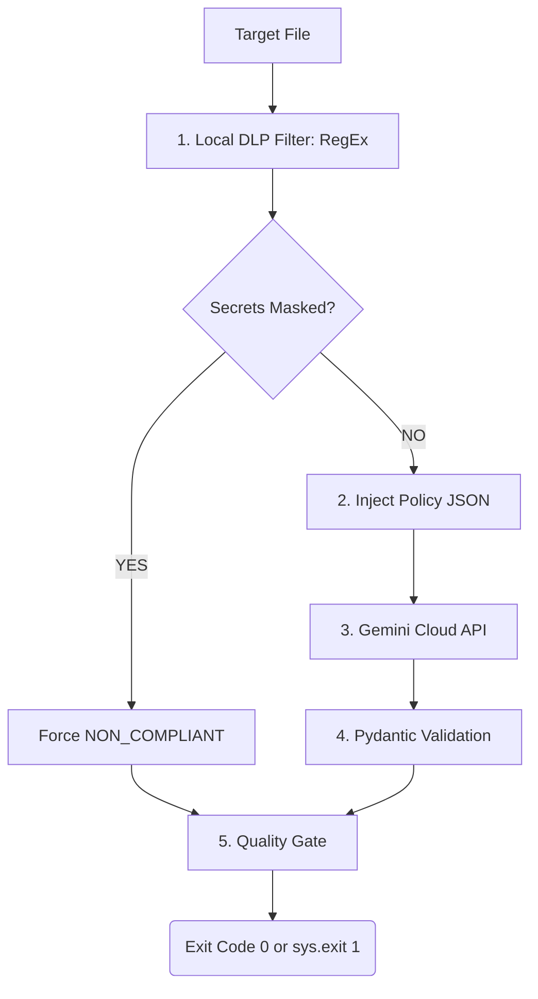

# AI Security Pipeline Guard

A Python-based CLI scanner and GitHub Action designed to detect security flaws in source code and Docker configurations using the Gemini API. 

The project implements a hybrid approach: it combines traditional deterministic security filters (Regex) with LLM analysis to enforce security rules without leaking sensitive data to the cloud.

#  How It Works (Pipeline Steps)

Policy-as-Code: Loads security guidelines from a decoupled configuration file (rules/docker_rules.json).

Local DLP Pre-filter: A local pre-compiled regex filter inspects the code. If any hardcoded credentials (API keys, AWS tokens, passwords) are found, they are redacted locally (re.subn()) before any cloud API calls.

Resilient Cloud Call: The sanitized code is sent to the Gemini API. The network call is wrapped in a Tenacity retry decorator using exponential backoff to handle transient errors.

Schema Enforcement: Raw JSON output from the AI is validated against a strict Pydantic model (BaseModel) to eliminate hallucinations.

Deterministic Override (Safety Fuse): If a secret was masked in Step 2, the script automatically overrides the AI's verdict, forcing the final status to NON_COMPLIANT.

Quality Gate (Exit Codes): Returns sys.exit(1) upon detecting NON_COMPLIANT status, allowing it to natively block unsafe deployments in CI/CD.

# Quick Start

Prerequisites

Python 3.10+
Google Gemini API Key

1. Installation
Install all required production and testing libraries:

Bash
pip install -r requirements.txt

2. Configure Environment
Create a .env file in the root directory:

Bash
GOOGLE_API_KEY=your_actual_gemini_api_key_here
⚠️ Note: The .env file is explicitly added to .gitignore to prevent accidental credential leaks.

# Usage

Local Execution
Full Scan (Default): Scans all files in the examples/ directory.

Bash
python src/scanner.py

Targeted Scan (CI/CD Mode): Scan specific files to optimize API quota.

Bash
python src/scanner.py examples/vulnerable_app.py
Running Automated Tests

# The project includes a pytest suite to verify the DLP regular expressions and deterministic override logic:

Bash
pytest

# CI/CD Integration (GitHub Actions)
This scanner is fully integrated as a pipeline Quality Gate. It triggers automatically on push and pull_request events.